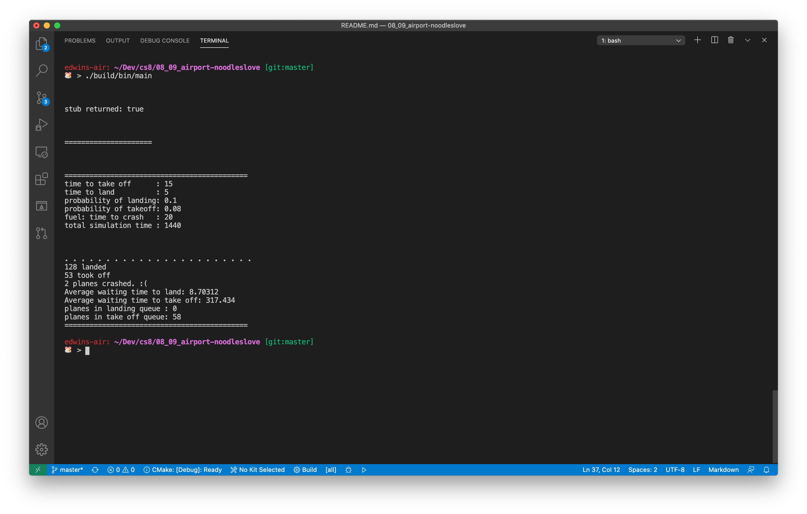

# editor_c

# Work Report

## Name: <ins> Bojian Ho </ins>

## Features:

- Not Implemented:
  - None

  

- Implemented:
  - Aiport class with start_takeoff, start_landing and one_second to simulate
  an airport. 
  - Airport simulate function, which takes in takeoff time, landing time, 
  landing probability, takeoff probability, fuel for landing planes and 
  simulation time. 
  - Queue class with push, pop, front, traverse, size and empty features.
  - Queue class also implemented with iterator.
  - Stack class with push, pop, top, traverse, size and empty features.
  - Stack class also implemented with iterator.

  

- Partly implemented:
  - None

  

- Bugs
  - Features that are implemented are bug-free.

  

## Output:

# Reflections:

- Any thoughts you may have and would like to share.
